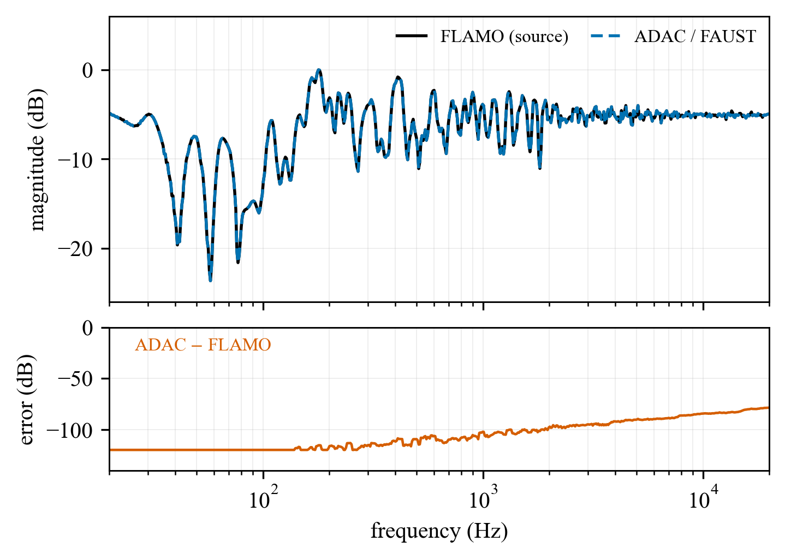
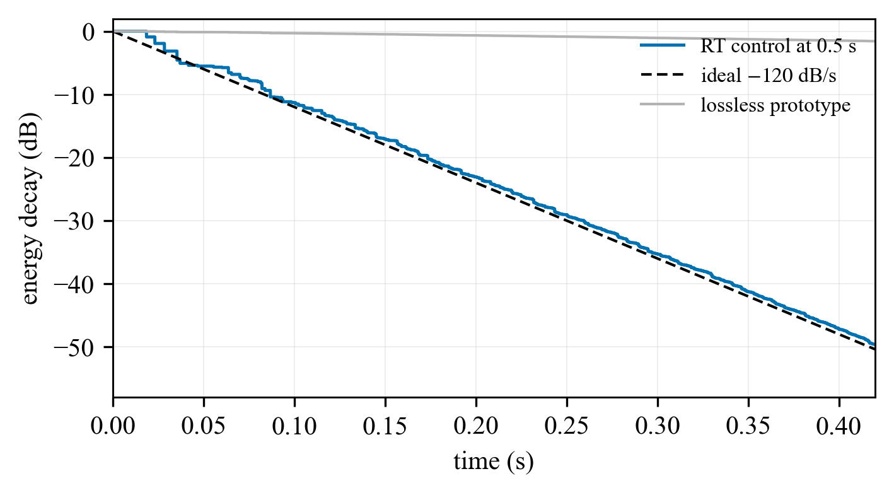
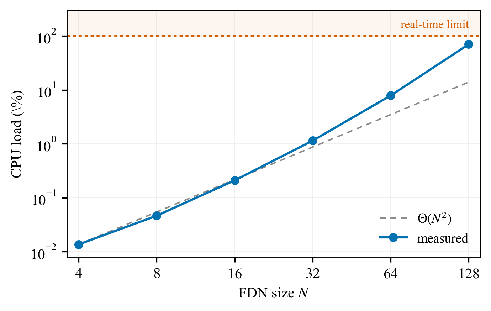

<div align="center">

# ADAC

**Automatic Differentiable Audio Compilation**

[](https://www.python.org/downloads/)
[](LICENSE)
[](#testing)
[](https://adac.readthedocs.io/en/latest/)


*from differentiable audio research to efficient real-time DSP*

</div>

<p align="center">
  <picture>
    <source media="(prefers-color-scheme: dark)" srcset="assets/fig2-dark.svg">
    
  </picture>
</p>

<p align="center">
  compile trained models to real-time DSP&nbsp; · &nbsp;hear the optimisation as it trains&nbsp; · &nbsp;stability-certified before every export
</p>

---

> [**Documentation**](https://adac.readthedocs.io) ·
> [**Report a Bug**](https://github.com/cucuwritescode/adac/issues)

## the problem

researchers design and optimise audio processors in differentiable frameworks such as [FLAMO](https://github.com/gdalsanto/flamo), but deploying them as efficient real-time DSP requires manual reimplementation. this is error-prone and creates a gap between research prototypes and usable tools. the worked example throughout is the feedback delay network (FDN), which exercises every part of the compiler.

## how it works

the pipeline traverses the model graph, extracts all parameters (delays, gains, matrices, filters), serialises them to a JSON intermediate representation, and generates valid FAUST DSP code. extraction is map-aware: matrix types with non-identity maps (orthogonal, hadamard, householder) serialise the effective matrix the model applies, with the raw trainable weights preserved for round-tripping. `json_to_flamo` reconstructs the original model from the config.

on top of the codegen core:

| | |
|---|---|
| **`HotReload`** | republishes the model to a running FAUST plugin during training, so you hear the optimisation while it runs |
| **macro-controls** | `rt60`, `dry_wet`, and `pre_delay` knobs layered onto the generated plugin without touching the trained parameters |
| **`certify`** | computes a stability certificate for every feedback loop, written as `.cert.json` next to the `.dsp` |
| **`export_juce`** | turns a config into an installed VST3/AU plugin in one call |

## installation

```bash
pip install -e .          #core compiler, numpy only
pip install -e ".[full]"  #full model support: flamo + pytorch
```

building plugins additionally requires the [FAUST](https://faust.grame.fr) distribution and [JUCE](https://juce.com).

## quick start

```python
import adac

#given a trained model and sample rate
faust_code = adac.flamo_to_faust(model, fs=48000, name="MyReverb")

#write to file
with open("reverb.dsp", "w") as f:
    f.write(faust_code)
```

or use the two-step pipeline for inspection:

```python
config = adac.flamo_to_json(model, fs=48000, name="MyReverb")
faust_code = adac.json_to_faust(config, controls={"rt60": True, "dry_wet": True})
```

<details>
<summary><b>hear it while it trains</b></summary>
<br>

```python
live = adac.HotReload(fs=48000, name="MyReverb", controls={"rt60": True})
for step in range(n_steps):
    loss = criterion(model(x), target)
    loss.backward()
    optimiser.step()
    live.update(model)
live.update(model, force=True)
```

the hot-reload CLAP plugin (FAUST interpreter plus file watcher) lives in `faust/architecture/clap/`. reloads take about 100 ms and knob positions survive them. full script: `examples/live_training.py`.

</details>

<details>
<summary><b>ship it</b></summary>
<br>

```python
adac.export_juce(
    adac.flamo_to_json(model, fs=48000, name="MyReverb"),
    "exported/", name="MyReverb",
    controls={"rt60": True, "dry_wet": True, "pre_delay": True},
    juce_modules="~/JUCE/modules",
    build=True,
)
```

one call: FAUST generation, stability certificate, JUCE project, release build, install into the user plugin folders (macOS). the export refuses to build a model whose certificate says `unstable` or `not-certified`; pass `strict=False` to override. full script: `examples/export_plugin.py`.

</details>

<details>
<summary><b>certify</b></summary>
<br>

```python
cert = adac.certify(config)
print(cert["verdict"])
```

the criterion is small-gain: the product of per-element spectral norms around each feedback loop must stay below one at every frequency, evaluated on the parameter values as emitted (single precision). verdicts are `certified-stable`, `marginally-stable`, `indeterminate`, `not-certified`, `unstable`. a lossless prototype is marginally stable; with the `rt60` control it is certified at any knob position.

</details>

## equivalence

generated FAUST matches the source model sample-exactly, direct paths included. the energy decay of the compiled plugin follows the reference throughout, and the underlying impulse responses agree to within single-precision arithmetic noise. all four stereo paths match identically; the suite pins them.

<p align="center">
  <picture>
    <source media="(prefers-color-scheme: dark)" srcset="plots/equivalence-dark.png">
    
  </picture>
</p>

the rt60 macro-control, measured by Schroeder integration, follows the ideal decay for the slider value:

<p align="center">
  <picture>
    <source media="(prefers-color-scheme: dark)" srcset="plots/rt60_validation-dark.png">
    
  </picture>
</p>

cost stays well within real time as the network grows: a 32-line FDN, a large reverberator, runs at roughly ninety times real time on a single core, tracking the predicted Θ(N²) until the feedback matrix exceeds the cache.

<p align="center">
  <picture>
    <source media="(prefers-color-scheme: dark)" srcset="plots/scaling-dark.png">
    
  </picture>
</p>

regenerate the light figures with `python examples/make_plots.py`, then the dark variants with `python examples/make_dark_plots.py`.

## supported modules

| source module | FAUST output | description |
|---|---|---|
| `parallelDelay` | `@(n)` / `de.fdelay` | integer or fractional sample delays |
| `Gain` / `Matrix` | sum-of-products function | mixing matrices (hoisted, map-aware) |
| `HouseholderMatrix` | sum-of-products function | emitted as the effective matrix |
| `parallelGain` | `*(g)` | per-channel diagonal gains |
| `parallelSOSFilter` | `fi.tf2(...)` | cascaded biquad filters |
| `Series` | `:` | sequential composition |
| `Parallel` | `,` / `:>` | side-by-side or summing |
| `Recursion` | `~` | feedback loops (FDN core) |
| `Biquad` / `SVF` | `fi.tf2` / `fi.svf.*` | single-channel filters |
| `Shell` | *(unwrapped)* | FFT wrapper skipped |

## testing

```bash
pytest                 #unit tests
pytest -m integration  #integration, needs faust + full install
```

200 unit tests validate the full pipeline: map-aware parameter extraction, delay quantisation, SOS normalisation, gain classification, graph traversal, code generation, macro-control wiring, multichannel arities, hot-reload publishing, certificate verdicts, and export orchestration.

integration tests compare impulse responses between the source model (frequency domain) and generated FAUST (time domain) sample-by-sample.

## project structure

```
src/adac/
  codegen/
    flamo_to_json.py     parameter extraction and graph traversal
    json_to_faust.py     FAUST code generation and macro-controls
    json_to_flamo.py     model reconstruction from JSON config
    flamo_to_faust.py    convenience wrapper (both steps)
  hotreload.py           training-time live publishing
  certificate.py         small-gain stability certificate
  export.py              JUCE plugin export
examples/
    live_training.py
    export_plugin.py
    make_plots.py
    make_dark_plots.py
tests/
    test_flamo_to_json.py
    test_json_to_faust.py
    test_flamo_to_faust.py
    test_param_extraction.py
    test_hotreload.py
    test_certificate.py
    test_export.py
    integration/
        test_ir_comparison.py
        generate_flamo_ir.py
```

## related projects

- [FLAMO](https://github.com/gdalsanto/flamo) — differentiable audio processing framework
- [pyFDN](https://github.com/artificial-audio/pyFDN) — python feedback delay networks
- [FAUST](https://faust.grame.fr/) — functional audio stream

## license

MIT — see [LICENSE](LICENSE) for details.
